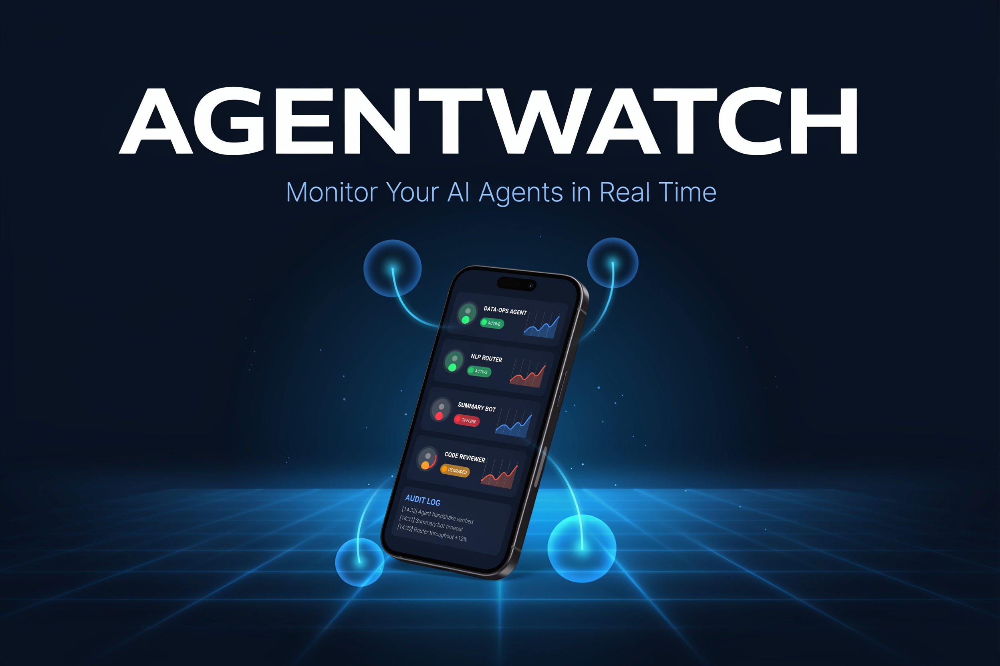

<div align="center">



# 🤖 AgentWatch

**Enterprise AI agent monitoring — visibility and governance for your entire agent fleet**

  

*Open Mobile Hub AI Agent Competition 2025*

</div>

<br/>

AgentWatch is a mobile-first enterprise dashboard for monitoring, controlling, and auditing AI agents across your organization. Built with React Native and real-time WebSocket streaming, it closes the governance gap that most AI teams face once agents move into production — giving ops and security teams live visibility into agent health, policy compliance, and audit trails from any iOS or Android device.

## ✨ Features

- **Real-time dashboard** — live agent performance metrics streamed via WebSocket with sub-second updates
- **Agent lifecycle control** — start, stop, and reconfigure agents directly from the mobile UI
- **Policy governance** — define and enforce rate limits, content filters, and access control rules per agent
- **Proactive alerting** — severity-tiered notifications for anomalies, errors, and policy violations
- **Audit trail** — immutable compliance logs capturing every status change and policy event
- **Dark/light theme** — automatic system-aware theme switching with offline-graceful networking

## 🎥 Demo

[](https://www.youtube.com/watch?v=CXPLqqjszaM)

## 🛠️ Tech Stack

**Mobile (React Native)**
- React Native 0.81+ with TypeScript
- React Navigation for screen routing
- WebSocket client for real-time updates
- Axios for REST API calls

**Backend (Node.js)**
- Express.js REST API
- WebSocket server for live event broadcasting
- CORS-enabled mock data simulation for demo purposes

## 🚀 Getting Started

**Prerequisites:** Node.js 18+, React Native development environment, iOS/Android simulator or device.

```bash
# 1. Clone and install frontend deps
git clone https://github.com/kyisaiah47/AgentWatch.git
cd AgentWatch
npm install

# 2. Start the backend
cd backend && npm install && npm start

# 3. Start Metro bundler (root directory)
npm start

# 4. Run on device / simulator
npx react-native run-ios     # iOS
npx react-native run-android # Android
```

## 📄 License

MIT
